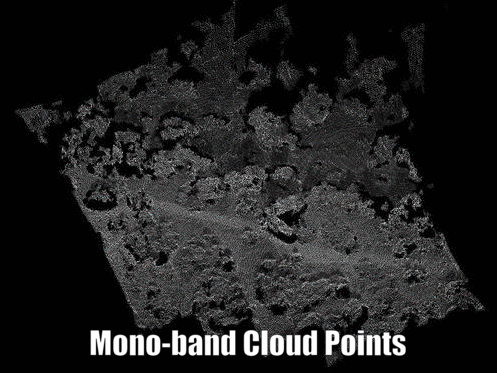
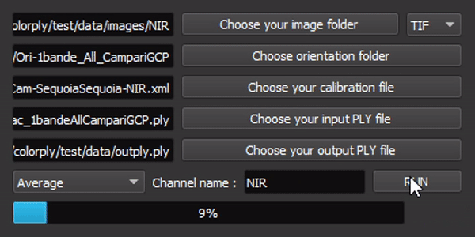
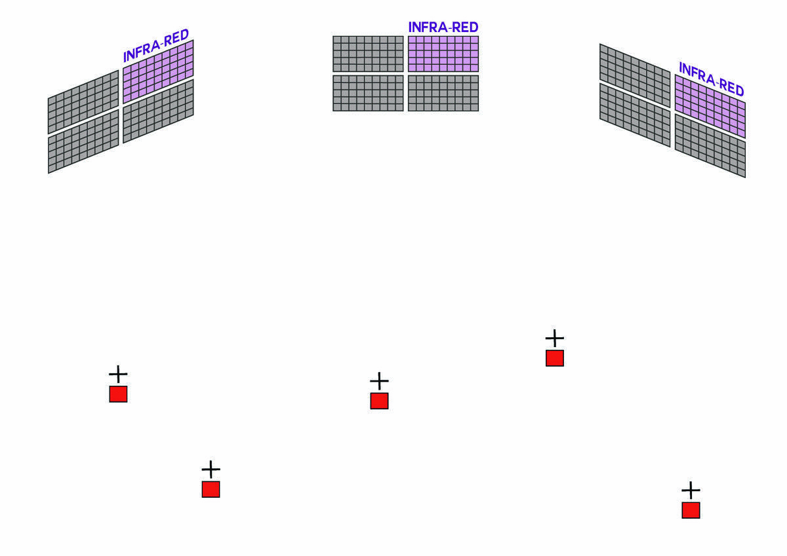

# colorply

**A multispectral photogrammetry application**

## Overview

**Colorply** is an open source python application which add new wavelength channels to a 3D cloud of points from a set of referenced image and uses images calibration from MicMac. 
This package comes with a **GUI**, to make tasks easier if you are not used to *MicMac*.

<p align="center">
  <b>Multispectral Cloud of Points</b><br>
  
  <br>
</p>

The black and white image is the initial cloud of points created from one channel, RED.
The colored image is the result of **Colorply**, adding the channel REG, NIR, GREEN.

### About

This project alone was made in a week, in a bigger project of photogrammetry engineering. The whole project focused in testing and evaluating a multispectral camera, the *Parot Sequoia*. Then, a major part used this camera to generate multispectral 3D cloud of points for remote sensing purposes like vegetation classification, all in 3D. Because *MicMac* works only for RGB (or maximum 3-channels images), **Colorply** was created and handles as many channels as you want and complete an existing 3D points from multispectral images.

### Dependencies

This package depends on :
  - PyQt5
  - lxml
  - plyfile
  - numpy
 
PyQt5 is only used fot the **GUI** of this application. As it can be a bit tricky to understand the file and directory names generated by *MicMac*, we decided to create an interface for it. It is not obligatory to use this interface, you can freely use and modify the python modules.

### Installation

To install this package, clone this repository and from the command line in the root folder, use :

`pip install .`

This will install all the dependencies and add **Colorply** to your python environment, usually saved in *path_to_anaconda\lib\site-packages*.


## Usage

### MicMac

**Colorply** works hands in hands with *MicMac* which is an open source photogrammetric software. You can download it from GitHub at https://github.com/micmacIGN/micmac, or from the main page at https://micmac.ensg.eu/index.php/Install.
If you are new to *MicMac*, take a look a the documentation https://github.com/micmacIGN/Documentation/blob/master/DocMicMac.pdf and this active forum :http://forum-micmac.forumprod.com/.


### Colorply

#### How it looks

The interface is simple, but all options are linked !

<p align="center">
  <b>Colorply GUI</b><br>
  
  <br>
</p>

To use this package, simply 

```python
from colorply.ui import colorply_window

colorply_window()
```


#### How it works

The main algorithm is based on the so called *image formula*. This equation links 3D coordinates points to image coordinates points, and depends on the camera calibration (the rotation, the distorsion and PPS).


<p align="center">
  
</p>


<p align="center">
  
</p>


## Licence
The code is under the MIT licence
