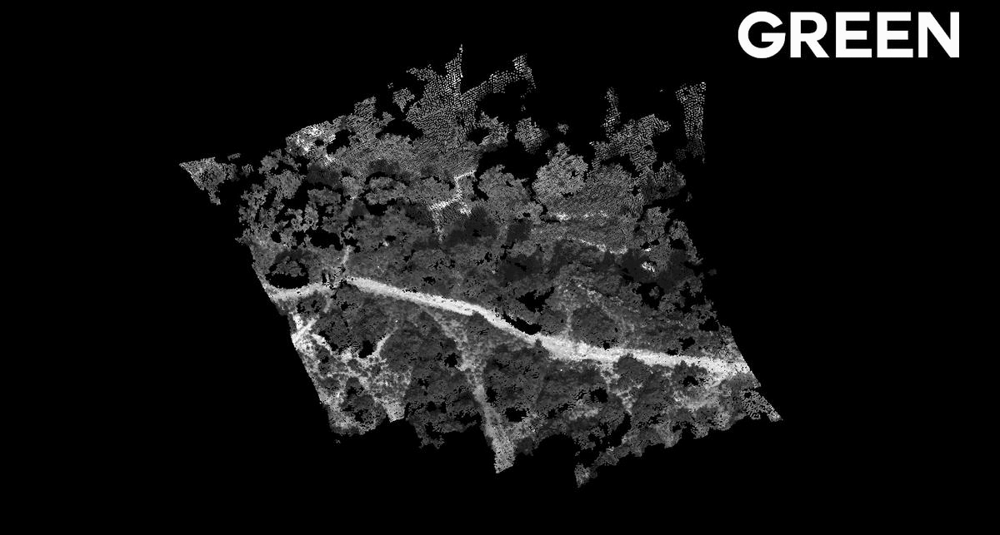
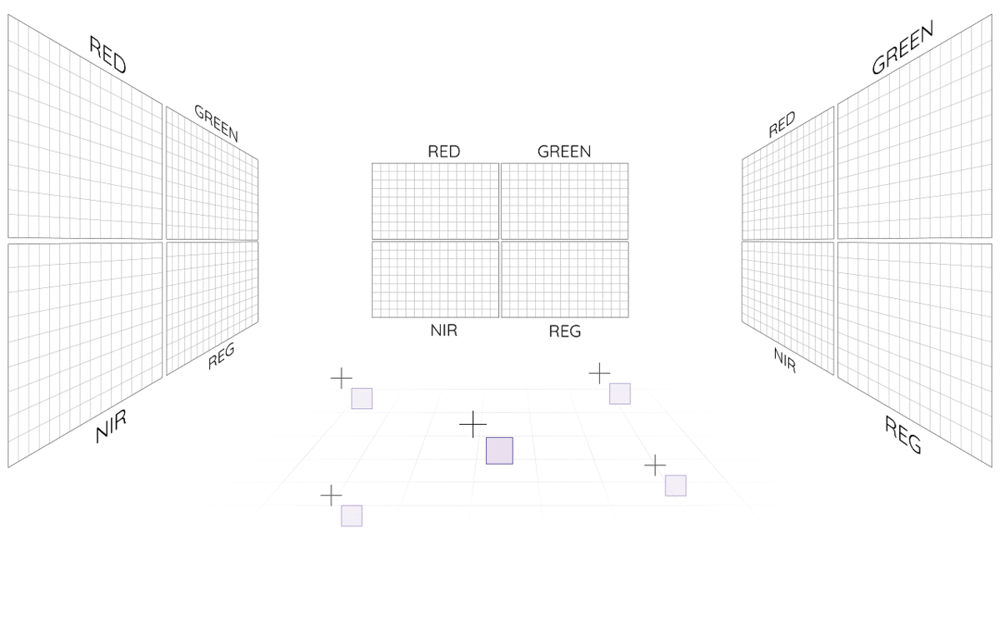
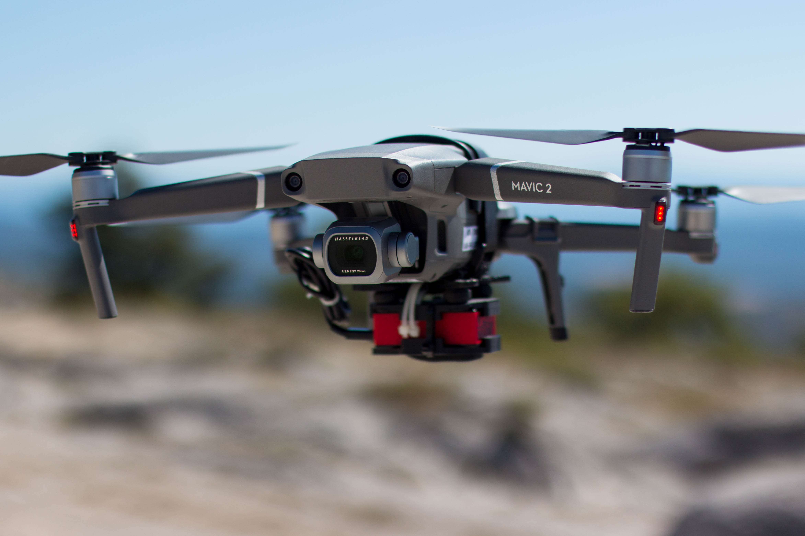

  

# colorply

**A multispectral photogrammetry application**

## Overview

**Colorply** is an open source python application which add new wavelength channels to a 3D cloud of points from a set of referenced images and uses images calibration from MicMac. 
This package comes with a **GUI**, to make tasks easier if you are not used to *MicMac*.

<p align="center">
  <b>Multispectral Cloud of Points</b><br>
  
  <br>
</p>

These models are models oriented in the same relative coordinate system. However, these models
are composed of only one channel. **Colorply** merges any channels from any models, as long as they are 
in the same coordinate system.

### About

This project alone was made in a week, in a bigger project of photogrammetry engineering. The whole project focused in testing and evaluating a multispectral camera, the *Parot Sequoia*. Then, a major part used this camera to generate multispectral 3D cloud of points for remote sensing purposes like vegetation classification, all in 3D. Because *MicMac* works only for RGB (or maximum 3-channels images), **Colorply** was created and handles as many channels as you want and complete an existing 3D points from multispectral images.

### Dependencies

This package depends on :
  - PyQt5
  - lxml
  - plyfile
  - numpy
 
PyQt5 is only used fot the **GUI** of this application. As it can be a bit tricky to understand the file and directory names generated by *MicMac*, we decided to create an interface for it. It is not obligatory to use this interface, you can freely use and modify the python modules.

### Installation

To install this package, clone this repository and from the command line in the root folder, use :

`pip install .`

This will install all the dependencies and add **Colorply** to your python environment, usually saved in *path_to_anaconda\lib\site-packages*.


## Usage

### MicMac

**Colorply** works hands in hands with *MicMac* which is an open source photogrammetric software. You can download it from GitHub at https://github.com/micmacIGN/micmac, or from the main page at https://micmac.ensg.eu/index.php/Install.
If you are new to *MicMac*, take a look a the documentation https://github.com/micmacIGN/Documentation/blob/master/DocMicMac.pdf and this active forum :http://forum-micmac.forumprod.com/.


### Colorply

#### How it looks

The interface is simple, but all options are linked !

<p align="center">
  <b>Colorply GUI</b><br>
  
  <br>
</p>

To use this package, run main.py or 

```python
from colorply.ui import interface

interface()
```

If you prefer doing it manually, you can use the functional implementation:

```python
from colorply import add_cloud_channel

# Load the 3D model
input_ply = "test/data/result/RVB_GRE.ply"
# Load MicMac calibration files
calibration_file = "test/data/calibration/Ori-1bande_All_CampariGCP/AutoCal_Foc-4000_Cam-SequoiaSequoia-GRE.xml"
# Load the orientation files for all images in the scene
orientation_dir = "test/data/calibration/Ori-1bande_All_CampariGCP"
# Load the images (corresponding to the orientation files)
image_dir = "test/data/images/RED"
# Additional arguments
image_ext = "TIF"
channel = "RED"
# Resulting ply
output_ply = "output.ply"

# Project all points in `input_ply` to `images_dir`.
# Create a new ply, the operation is not inplace.
add_cloud_channel(input_ply, output_ply,
                  calibration_file, orientation_dir, 
                  image_dir, image_ext, channel)
```

You can also use the commandlines system

```pycon
$ python colorply   --inply path/to/input_ply
                    --outply path/to/output_ply
                    --calib path/to/calib_xml
                    --oridir path/to/orientation_folder
                    --imdir path/to/image_folder
                    --imext image_extension
                    --channel name_of_new_channel
                    --mode mode_used_to_merge_new_radiometry
```
Use help --argument for additional information.

#### How it works

The main algorithm is based on the so called *image formula*. This equation links 3D coordinates points *M* to image coordinates points *m*, and depends on the camera calibration (the rotation *R*, the distorsion and PPS *S*, focal length *F*).


<p align="center">
  
</p>

To visualize this formula, let's consider this short animation :

<p align="center">
  
</p>

The red crosses represent the dense cloud points, computed from the RED channel. These points are projected in NIR channel images. The radiometry at this location is then affected back to the points, adding an extra channel to the cloud.


## Application

<p align="center">
  
</p>

### About

This project was used for remote sensing classification from a multispectral camera. The camera *Parrot Sequoia* was first calibrated and tested on sample areas. Then, it was fixed to a civil drone and we flew over high altitudes forest to estimate the evolution of vegetation species. **Colorply** was used to create a multispectral cloud of points, to improve our classification by adding extra features. The clusters were made from a random forest skeleton, using all radiometries (RED, REG, NIR, GRE) and the points 3D positions.

### Classification

In this repository, you can run the classification on the provided data [here](test/data/result/RVB_GRE_RED_REG_NIR_NDVI.ply).
For this short example (for fast processing), the classification results are described as follows :

<p align="center">
  
  
</p>

The confusion matrix for this sample is :

|           | Terrain   | Oak       | Shrub     | Grass     |
|-----------|-----------|-----------|-----------|-----------|
|**Terrain**| **410**   | 0         | 0         | 16        |
| **Oak**   | 0         | **260**   | 10        | 0         |
| **Shrub** | 0         | 10        | **137**   | 16        |
| **Grass** | 23        | 0         | 11        | **192**   |

**Global accuracy : 92.07%.**

## Licence
The code is under the MIT licence
