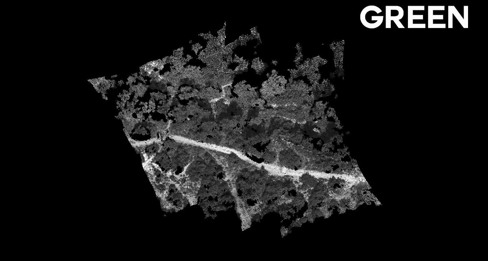

=====
About
=====

**Colorply** is an open source python application which add new wavelength channels to a 3D cloud of points
from a set of referenced images and uses images calibration from **MicMac**. This package comes with a GUI,
to make tasks easier if you are not used to MicMac.

These models are models oriented in the same relative coordinate system.
However, these models are composed of only one channel.
**Colorply** merges any channels from any models, as long as they are in the same coordinate system.

This project alone was made in a week, in a bigger project of photogrammetry engineering.
The whole project focused in testing and evaluating a multispectral camera, the Parot Sequoia.
Then, a major part used this camera to generate multispectral 3D cloud of points for remote sensing purposes like vegetation classification, all in 3D.
Because MicMac works only for RGB (or maximum 3-channels images),
**Colorply** was created and handles as many channels as you want and complete an existing 3D points from multispectral images.

===========
Instalation
===========

This package depends on :
  - PyQt5
  - lxml
  - plyfile
  - numpy

PyQt5 is only used fot the **GUI** of this application. As it can be a bit tricky to understand the file and directory names generated by **MicMac**,
we decided to create an interface for it. It is not obligatory to use this interface, you can freely use and modify the python modules.

To install this package, clone this repository and from the command line in the root folder, use :

.. code-block:: pycon

    git clone https://github.com/arthurdjn/colorply
    cd nets
    pip install .

Or you can download it directly with pip:

.. code-block:: pycon

    pip install colorply

This will install all the dependencies and add **Colorply** to your python environment, usually saved in *path_to_anaconda\lib\site-packages*.

=====
Usage
=====

**Colorply** works hands in hands with *MicMac* which is an open source photogrammetric software. You can download it from GitHub_, or from the main page_.
If you are new to *MicMac*, take a look a the documentation_ and this active forum_.

.. _GitHub: https://github.com/micmacIGN/micmac
.. _page: https://micmac.ensg.eu/index.php/Install
.. _documentation: https://github.com/micmacIGN/Documentation/blob/master/DocMicMac.pdf
.. _forum: http://forum-micmac.forumprod.com/

How it works
============

The interface is simple, but all options are linked !

.. image:: images/colorply.gif

To use this package, run main.py or

.. code-block:: python

from colorply.ui import interface

interface()

If you prefer doing it manually, you can use the functional implementation:

.. code-block:: python

    from colorply import add_cloud_channel

    # Load the 3D model
    input_ply = "test/data/result/RVB_GRE.ply"
    # Load MicMac calibration files
    calibration_file = "test/data/calibration/Ori-1bande_All_CampariGCP/AutoCal_Foc-4000_Cam-SequoiaSequoia-GRE.xml"
    # Load the orientation files for all images in the scene
    orientation_dir = "test/data/calibration/Ori-1bande_All_CampariGCP"
    # Load the images (corresponding to the orientation files)
    image_dir = "test/data/images/RED"
    # Additional arguments
    image_ext = "TIF"
    channel = "RED"
    # Resulting ply
    output_ply = "output.ply"

    # Project all points in `input_ply` to `images_dir`.
    # Create a new ply, the operation is not inplace.
    add_cloud_channel(input_ply, output_ply,
                      calibration_file, orientation_dir,
                      image_dir, image_ext, channel)

You can also use the commandlines system

.. code-block:: pycon

    python colorply     --inply path/to/input_ply
                        --outply path/to/output_ply
                        --calib path/to/calib_xml
                        --oridir path/to/orientation_folder
                        --imdir path/to/image_folder
                        --imext image_extension
                        --channel name_of_new_channel
                        --mode mode_used_to_merge_new_radiometry

Use help --argument for additional information.
